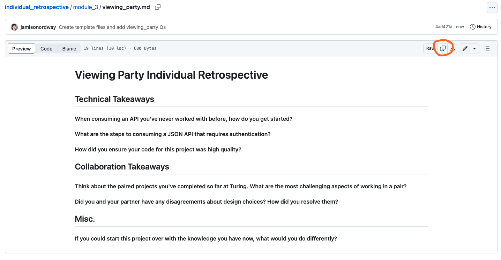
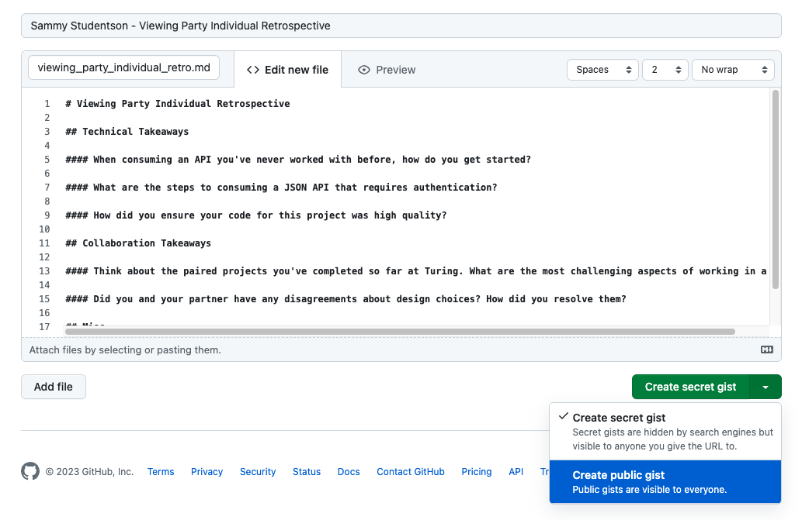

# Individual Retrospectives
Turing School reflection templates

### How to use these templates

1. Navigate this repository to find the template for your specific project/assignment
2. Click the 'copy' button in the upper left-hand corner

4. Create a public gist with a `.md` extension and paste the template

5. Complete your responses to the provided questions
6. If applicable, include a link to your gist with the submission form you use to turn in your project. 